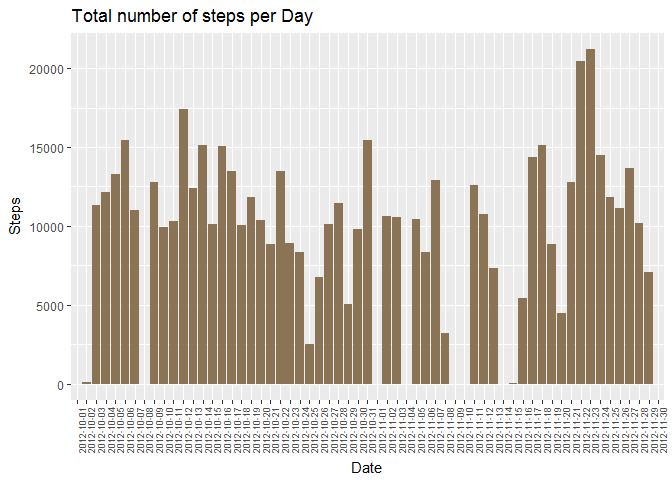
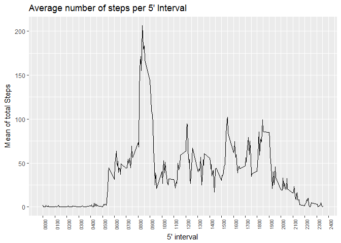
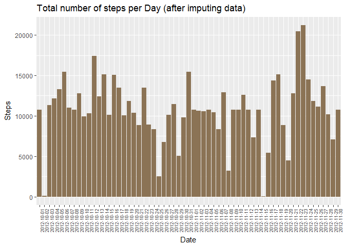
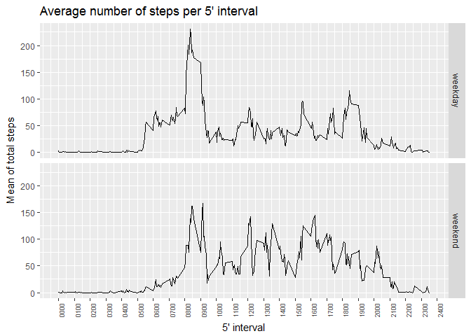

# Reproducible Research: Peer Assessment 1
 

## Loading and preprocessing the data

```r
act <- read.csv("activity.csv")
```

  
## What is mean total number of steps taken per day?

```r
library(ggplot2)
library(dplyr)

# Histogram of steps per day
stepsbyday <-   group_by(act, date)  %>% 
                summarize(totsteps=sum(steps, na.rm=TRUE))  

g <-    ggplot(stepsbyday, aes(x=date, y=totsteps)) + 
        geom_bar(stat="identity", fill="burlywood4") +
        xlab("Date") +
        ylab("Steps") +
        ggtitle("Total number of steps per Day") +
        theme(axis.text.x = element_text(angle = 90, hjust = 1, size=7))
print(g)
```

<!-- -->

```r
# Calculation of the mean of the total steps taken each day
meantotsteps <- as.integer(mean(stepsbyday$totsteps, na.rm=TRUE))

# Calculation of the median of the total steps taken each day
mediantotsteps <- median(stepsbyday$totsteps, na.rm=TRUE)
```

  
#### Mean and Median

* The mean of the total steps taken each day is **9354.00** 

* The median of the total steps taken each day is **10395.00**

  
## What is the average daily activity pattern?


```r
# Line chart of average steps per interval across all days
stepsbyint <-   group_by(act, interval)  %>% 
                summarize(avgsteps=mean(steps, na.rm=TRUE))

# Format intevals to be neatly presented in the plots
stepsbyint$int <- sprintf("%04d", stepsbyint$interval)

# Prepare the axis labs so the readablity can be improved
labs <- sprintf("%04d", seq(from=0,to=2400, by=100))

# Launches the plot
g <-    ggplot(stepsbyint, aes(x=interval, y=avgsteps)) + 
        geom_line() +
        xlab("5' interval") +
        ylab("Mean of total Steps") +
        ggtitle("Average number of steps per 5' Interval") +
        theme(axis.text.x = element_text(angle = 90, hjust = 1, size=7)) +
        scale_x_continuous(breaks=seq(from=0,to=2400, by=100), labels=labs)

print(g)
```

<!-- -->


  
#### Max average of steps per 5' interval across all days

* The maximum average of the total steps taken each interval across all days is **206.17** which happens in the interval **0835**

  
## Imputing missing values


```r
# Calculates the number of rows with missing values to report it later
missvalrows <- nrow(act)-sum(complete.cases(act))

# Imputes missing data (there are only NA in column steps) with the average steps in the 5' interval
for (i in 1:nrow(act))
if (is.na(act[i,"steps"])) act[i, "steps"] <- filter(stepsbyint,interval==act[i, "interval"])[1,"avgsteps"]

# Recalculate the summary of steps by date
stepsbyday <-   group_by(act, date)  %>% 
                summarize(totsteps=sum(steps, na.rm=TRUE))
                         

# Plot histogram of the total number of steps by date
g <-    ggplot(stepsbyday, aes(x=date, y=totsteps)) + 
        geom_bar(stat="identity", fill="burlywood4") +
        xlab("Date") +
        ylab("Steps") +
        ggtitle("Total number of steps per Day (after imputing data)") +
        theme(axis.text.x = element_text(angle = 90, hjust = 1, size=7))
print(g)
```

<!-- -->

```r
# Calculation of the mean of the total steps taken each day
meantotsteps <- as.integer(mean(stepsbyday$totsteps, na.rm=TRUE))

# Calculation of the median of the total steps taken each day
mediantotsteps <- median(stepsbyday$totsteps, na.rm=TRUE)
```


  
#### Mean and Median after imputing data:

* The mean of the total steps taken each day is **10766.00** 

* The median of the total steps taken each day is **10766.19**


#### Do these values differ from the estimates from the first part of the assignment? 

* Yes. 


#### What is the impact of imputing missing data on the estimates of the total daily number of steps?

* Both mean and median **increased**.

  
## Are there differences in activity patterns between weekdays and weekends?


```r
library(chron)
library(lubridate)

# Add a new factor column identifying dates in weekends 
act$we <- is.weekend(ymd(as.character(act$date)))
act$dayt <- ifelse(act$we==TRUE, "weekend", "weekday")

# Builds the summary table
stepsbyday_we <-   group_by(act[act$we==TRUE, ], interval)  %>% 
                   summarize(avgsteps=mean(steps, na.rm=TRUE))
stepsbyday_we$dayt <- 'weekend'

stepsbyday_wd <-   group_by(act[act$we==FALSE, ], interval)  %>% 
                    summarize(avgsteps=mean(steps, na.rm=TRUE))
stepsbyday_wd$dayt <- 'weekday'

stepsbydayt <- rbind(stepsbyday_we, stepsbyday_wd)

# Prepare the axis labs so the readablity can be improved
labs <- sprintf("%04d", seq(from=0,to=2400, by=100))

# Launches the faceting plot
g <-    ggplot(stepsbydayt, aes(x=interval, y=avgsteps)) + 
        geom_line() +
        xlab("5' interval") +
        ylab("Mean of total steps") +
        facet_grid(dayt~.) +
        ggtitle("Average number of steps per 5' interval") +
        theme(axis.text.x = element_text(angle = 90, hjust = 1, size=7)) +
        scale_x_continuous(breaks=seq(from=0,to=2400, by=100), labels=labs)

print(g)
```

<!-- -->

## Diferences between working week days and weekend days

* During weekends steps start later and keep until alter as well
* Average number of steps during the day is more stable during weekends

